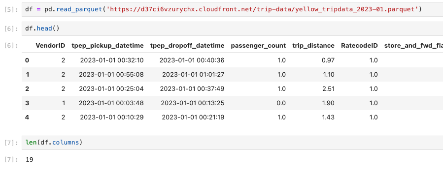
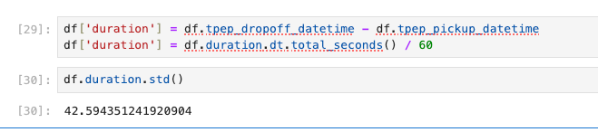
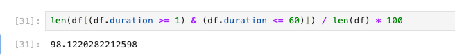
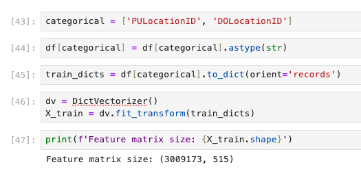
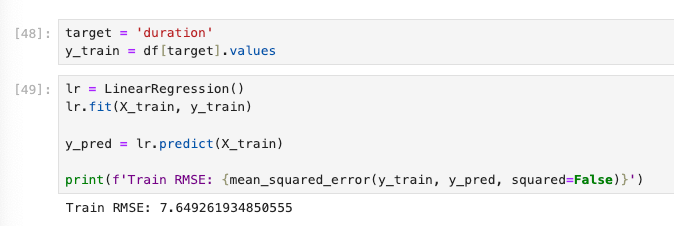
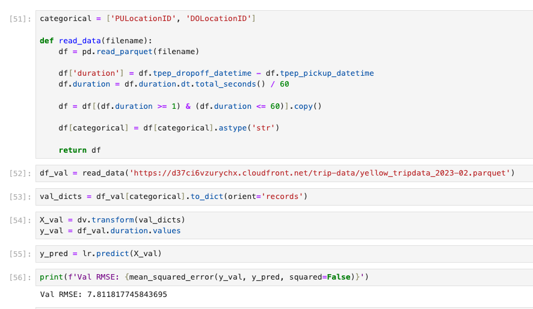

## Q1. Downloading the data
We'll use the same NYC taxi dataset, but instead of "Green Taxi Trip Records", we'll use "Yellow Taxi Trip Records".
Download the data for January and February 2023.
Read the data for January. How many columns are there?
### 19

## Q2. Computing duration
Now let's compute the duration variable. It should contain the duration of a ride in minutes.
What's the standard deviation of the trips duration in January?
### 42.59

## Q3. Dropping outliers
Next, we need to check the distribution of the duration variable. There are some outliers. Let's remove them and keep only the records where the duration was between 1 and 60 minutes (inclusive).
What fraction of the records left after you dropped the outliers?
### 98%

## Q4. One-hot encoding
Let's apply one-hot encoding to the pickup and dropoff location IDs. We'll use only these two features for our model.
Turn the dataframe into a list of dictionaries (remember to re-cast the ids to strings - otherwise it will label encode them)
Fit a dictionary vectorizer
Get a feature matrix from it
What's the dimensionality of this matrix (number of columns)?
### 515

## Q5. Training a model
Now let's use the feature matrix from the previous step to train a model.
Train a plain linear regression model with default parameters, where duration is the response variable
Calculate the RMSE of the model on the training data
What's the RMSE on train?
### 7,64

## Q6. Evaluating the model
Now let's apply this model to the validation dataset (February 2023).
What's the RMSE on validation?
### 7,8

