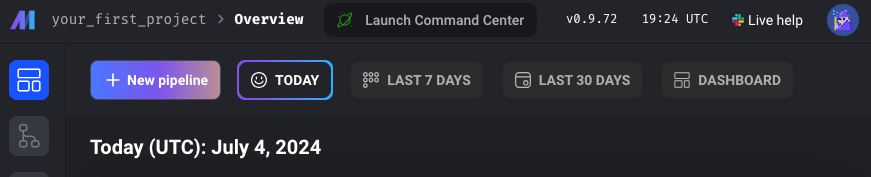
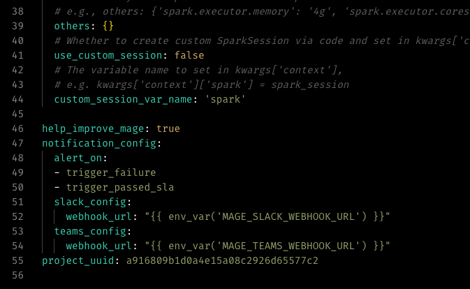
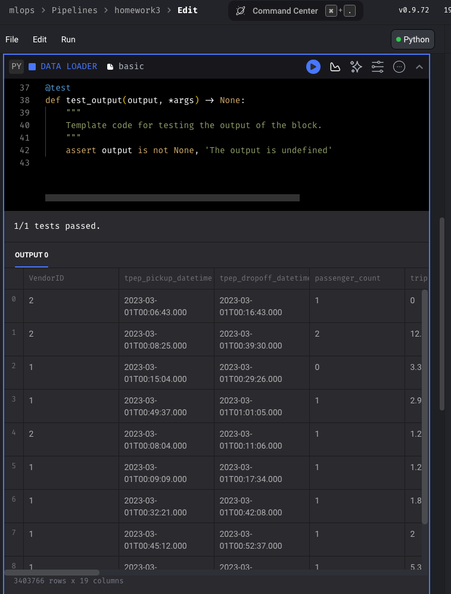
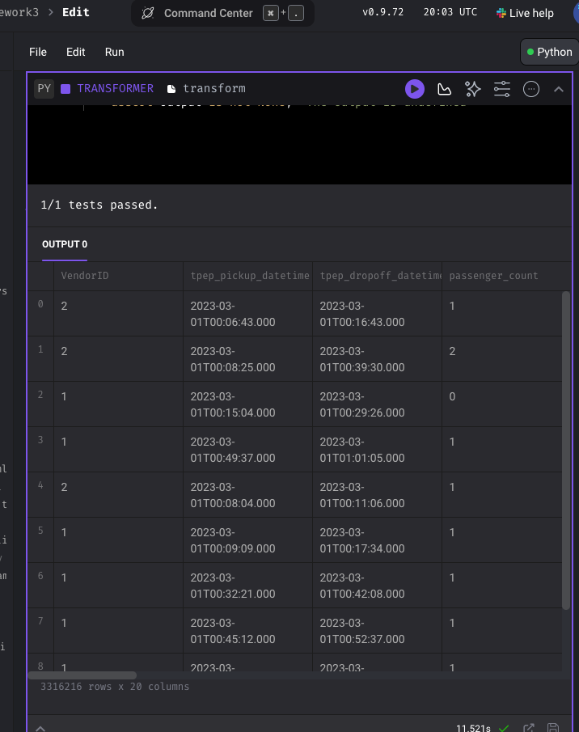
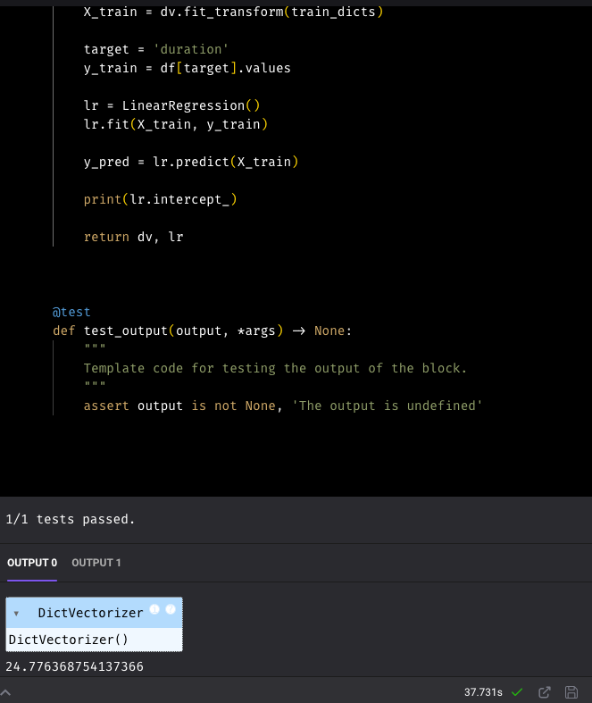
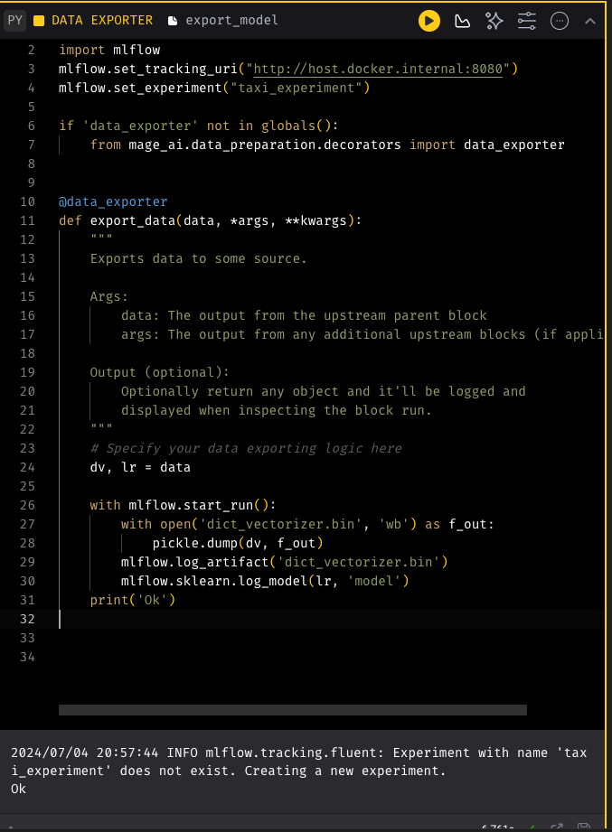
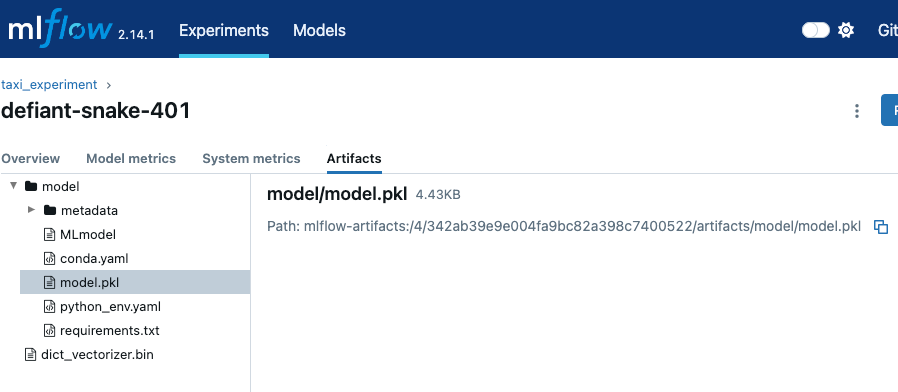

## Question 1. Run Mage
First, let's run Mage with Docker Compose. Follow the quick start guideline.
What's the version of Mage we run?

## Question 2. Creating a project
Now let's create a new project. We can call it "homework_03", for example.
How many lines are in the created metadata.yaml file?
### 55

## Question 3. Creating a pipeline
Let's create an ingestion code block.
In this block, we will read the March 2023 Yellow taxi trips data.
How many records did we load?
### 3,403,766

## Question 4. Data preparation
Let's use the same logic for preparing the data we used previously. We will need to create a transformer code block and put this code there.
Let's adjust it and apply to the data we loaded in question 3.
What's the size of the result?
### 3,316,216

## Question 5. Train a model
We will now train a linear regression model using the same code as in homework 1.
Fit a dict vectorizer.
Train a linear regression with default parameters.
Use pick up and drop off locations separately, don't create a combination feature.
Let's now use it in the pipeline. We will need to create another transformation block, and return both the dict vectorizer and the model.
What's the intercept of the model?
## 24,77

## Question 6. Register the model
Find the logged model, and find MLModel file. What's the size of the model? (model_size_bytes field):
## not exactly, but 4,534 the closest

