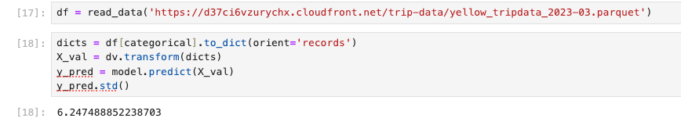

## Q1. Notebook
We'll start with the same notebook we ended up with in homework 1. We cleaned it a little bit and kept only the scoring part. You can find the initial notebook here.
Run this notebook for the March 2023 data.
What's the standard deviation of the predicted duration for this dataset?
### 6.24


## Q2. Preparing the output
What's the size of the output file?
### 66M


## Q3. Creating the scoring script
Now let's turn the notebook into a script.
Which command you need to execute for that?
### jupyter nbconvert --to script notebook.ipynb


## Q4. Virtual environment
Now let's put everything into a virtual environment. We'll use pipenv for that.
Install all the required libraries. Pay attention to the Scikit-Learn version: it should be the same as in the starter notebook.
After installing the libraries, pipenv creates two files: Pipfile and Pipfile.lock. The Pipfile.lock file keeps the hashes of the dependencies we use for the virtual env.
What's the first hash for the Scikit-Learn dependency?
I work with conda instead of pyenv, so here is just a packages list


## Q5. Parametrize the script
Let's now make the script configurable via CLI. We'll create two parameters: year and month.
Run the script for April 2023.
What's the mean predicted duration?
### 14.29


## Q6. Docker container
Now run the script with docker. What's the mean predicted duration for May 2023?
### 0.19


Dockerfile
```
FROM agrigorev/zoomcamp-model:mlops-2024-3.10.13-slim

WORKDIR /app
COPY requirements.txt starter.py ./
RUN pip install -r ./requirements.txt
RUN mkdir output

CMD ["2023", "5"]
ENTRYPOINT ["python", "starter.py"]
```
